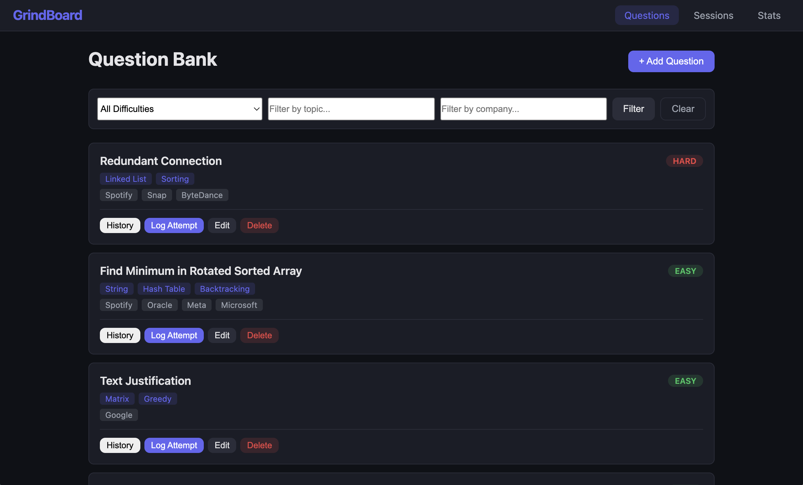

# GrindBoard

**Track your technical interview prep like an athlete tracks training.**

## Author

- Qingdong Gong — Question Bank Management
- Alexander Sholla — Practice Session Tracking

## Class

CS Web Development — [Northeastern University](https://www.northeastern.edu/)

## Project Objective

GrindBoard helps CS students organize and track their technical interview preparation. Students can build a personal question bank tagged by company, topic, and difficulty, then log each practice attempt with time spent, result, and notes. The app surfaces weak areas and tracks improvement across attempts.

## Screenshot



## Tech Stack

- **Backend:** Node.js, Express, MongoDB (native driver)
- **Frontend:** Vanilla JavaScript (client-side rendering), HTML5, CSS3
- **Database:** MongoDB with 2 collections (`questions`, `practice_sessions`)

## Getting Started

### Prerequisites

- Node.js (v18+)
- MongoDB running locally or a MongoDB Atlas connection string

### Installation

```bash
# Clone the repo
git clone https://github.com/Co1dBrew/GrindBoard.git
cd GrindBoard

# Install dependencies
npm install

# Set up environment variables
cp .env.example .env
# Edit .env and set your MONGO_URI
```

### Seed the Database

To populate the database with 1,000+ sample records:

```bash
npm run seed
```

### Run the App

```bash
# Development
npm run dev

# Production
npm start
```

Then open [http://localhost:3000](http://localhost:3000) in your browser.

## Usage

1. **Questions tab** — Browse, filter, add, edit, or delete interview questions
2. **Sessions tab** — Log practice attempts, view session history, edit or delete entries
3. **Stats tab** — View overall solve rate, average time, and per-topic breakdown

## Project Structure

```
GrindBoard/
├── app.js                  # Express server entry
├── db/connection.js        # MongoDB connection module
├── routes/
│   ├── questionRoutes.js   # Question CRUD API
│   └── sessionRoutes.js    # Session CRUD API
├── public/
│   ├── index.html          # SPA entry point
│   ├── css/                # Modular CSS files
│   └── js/                 # Client-side JS modules
├── scripts/seedData.js     # Database seed script
└── docs/                   # Design document
```

## License

This project is licensed under the [MIT License](LICENSE).
